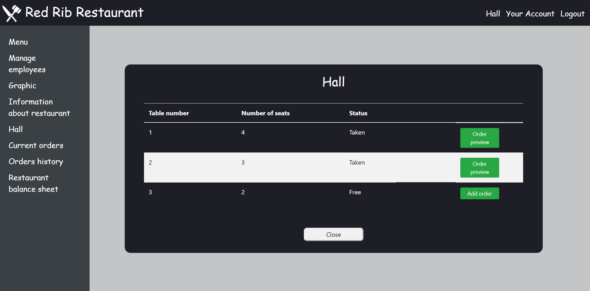
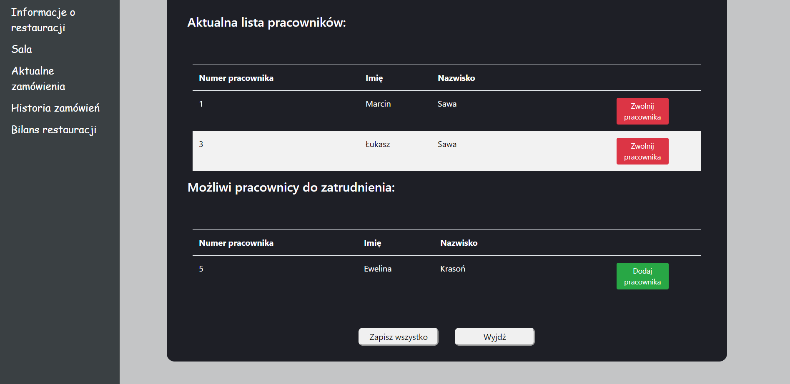

# restaurant-manager("Red Rib Restaurant")
REST application which allow to manage one or more restaurants from computer. 
The application is dedicated to all restaurant employees.
Using app is possible to add client's orders to online system or manage employees.

## Table of contents
* [Screenshots](#screenshots)
* [Technologies](#technologies)
* [Setup](#setup)

## Screenshots
### Main site for waiter

### Main site for manager

## Technologies
•	Java11
•	Spring
•	React.js
•	HTML
•	Cascading Style Sheet
•	PostgreSQL
•	Gradle
•	Lombok
•	Jackson

## Setup
To start application running postgreSql server is needed.
If this condition is met, we can run backend part in Java and then frontend part in React.
Then we need to go to localhost:8030 site. That's all.
